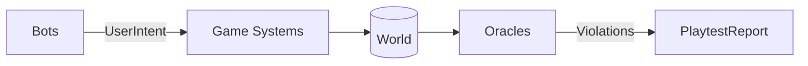

# bevy_swarm

An ECS-native, headless, in-process playtesting harness for [Bevy](https://bevy.org) games. Write WHAT to test, not WHEN to press.

**Targets Bevy 0.20** (currently `v0.20.0-rc.2` on crates.io). Uses the `MessageReader`/`MessageWriter` buffered-event API.

## Conventions

Workspace layout, artifact paths, update mode (`BEVY_SWARM_UPDATE`), versioning,
rule-name registry, and vocabulary are governed by [docs/conventions.md](docs/conventions.md)
— the single source of truth. Oracle rule names live in the [rule registry](docs/rules.md)
(`bevy_swarm::rules`).

## Bevy compatibility policy

Each bevy_swarm release supports **exactly one Bevy minor version**. No
cross-version compatibility shims — the harness tracks Bevy's API closely
(observers, message buffers, diagnostics), and carrying fallbacks doubles the
surface that can silently diverge from real game behavior.

| bevy_swarm | Bevy |
|-----------|------|
| 0.1.0 (unreleased) | 0.20 (`v0.20.0-rc.2` on crates.io) |

## Gameplay Snapshot Testing (Z11)

Record and compare per-frame state digests to detect gameplay regressions across versions:

```rust
use bevy_swarm::golden::{record_golden, check_golden, GoldenSet, Tolerance};

// Record a baseline (once):
let scenarios = vec![/* ... */];
record_golden(|| App::new(), &scenarios, "tests/swarm/golden").unwrap();

// Check against goldens (in CI or tests):
let set = GoldenSet::load("tests/swarm/golden").unwrap();
let report = check_golden(|| App::new(), &set, &Tolerance::default()).unwrap();
assert!(report.all_same(), "no regressions");
```

- **Approval workflow**: Set `BEVY_SWARM_UPDATE_GOLDEN=1` to rewrite golden files; commit the diff for review.
- **Determinism required**: Run `check_determinism` first; nondeterministic scenarios are flagged.
- **Cross-platform tolerance**: Float tolerance applies only when comparing across platforms; same-platform digest mismatches are failures.
- **Readable diffs**: If your game exposes state via `TestApi`, diffs show field names/values instead of raw hashes.

## What it does

- **Typed intent bots** — chaos (with uniform/aggressive/curious/idle personas), replay, pursuit, planner (aplib-style goal trees), synthetic_pointer and synthetic_keyboard (drive the REAL input chain through picking/ButtonInput, not shortcuts)
- **Invariant DSL** — scenario JSON with bounds checks, TestApi predicates, eventual assertions, query-target entity counts, differential rules (no_decrease/no_increase), rate limits, expert-rule oracles (WHEN/REQUIRE)
- **Oracles** — frozen-world soft-lock detection, Welford frame-time anomaly detection, true rolling p99, readiness gate, finite-transform NaN check (all entities, not only Gameplay)
- **CA² system coverage** — which registered systems actually executed, with zero instrumentation (wrap-safe schedule tick-age snapshots)
- **Failure minimization** — ddmin over the structured action log shrinks ANY failure (crashes and invariant violations) to a ready-to-save regression scenario with a trimmed duration, and fails honestly with `NotReproducible` when the log alone cannot reproduce the failure
- **Calibration** — `--calibrate` runs a chaos session and derives suggested invariants from archetype-count envelopes, with zero game annotations
- **Loud contracts** — missing picking backends, unresolved TestApi paths, vacuous setups REJECT the scenario instead of silently passing

## Usage

```toml
[dev-dependencies]
bevy_swarm = "0.1" # or path/git
```

```rust
use bevy_swarm::harness::{run_scenario, validate_scenario, Scenario};

let scenario: Scenario = serde_json::from_str(
    r#"{"bot":{"type":"planner","goals":{"kind":"primitive","path":"TestApi.score","check":"above","value":3,"emit":[{"intent":"choice","index":0}]}},"duration_s":1.0,"invariants":[]}"#,
)?;

let mut app = build_your_headless_app(); // your game's plugins + PlaytestPlugin
let report = run_scenario(&mut app, &scenario)?;
assert_eq!(report.status, "pass");
```

## Game-side contract (deliberately thin)

1. Optional: a `TestApi` resource implementing `TestApiResolve` (or `app.register_test_api::<YourType>()` for a custom type) — publish observable state (score, phase, hp...) for invariants and planner goals; world percepts (`Resource:`/`Component:` paths) work with ZERO game-side setup
2. `IntentSurface` — declare your game's input verbs; the chaos bot samples only from it
3. Optional: `ResetHooks`, `CheatHooks`, genre markers (`TurnBased`/`RealTime`), `Gameplay` marker component

Games with none of these still work: reflection-based percepts and auto-discovery calibration kick in, and the harness fails loudly rather than passing vacuously when a contract piece it needs is missing.

## Feature flags

- `agent` — BRP-based resident agent for live inspection and intent injection

## Architecture

At its core, the data flow per frame:



- **Bots** (chaos, replay, pursuit, planner) sample from your declared `IntentSurface` and write typed `UserIntent` messages
- **Game systems** consume those intents directly — same schedule, same binary, no adapter layer
- **Oracles** (frozen-world, frame-time anomaly, bounds checks, invariant DSL) watch the world and report violations
- **Synthetic input** is opt-in: `synthetic_pointer`/`synthetic_keyboard` bots drive the real `PointerInput`/`KeyPressInput` chain when a scenario asks for it
- The harness itself is pre/post-processing around the Bevy app — `run_scenario()` sets up, pumps the loop, then collects the report

## Testing

Two loops (see docs/conventions.md):

- **Outer loop (acceptance):** plain fixture games with ZERO bevy_swarm
  plumbing (`fixtures/*`) + JSON expectation files
  (`tests/swarm/golden/<fixture>/<variant>.json`). The runner
  (`tests/acceptance.rs`) drives the fixture-runner binary — the same
  path a user takes — and asserts on the report JSON contract
  (`docs/report-schema.json`). Bug variants are selected at runtime via
  the `FIXTURE_BUG` env var, so clean and buggy share one build.
- **Inner loop (unit):** `src/verify.rs` and module tests for algorithms
  and semantics.

To add a fixture: create `fixtures/<game>/` (depends on bevy ONLY),
add an adapter + arm in `tests/fixture-runner`, and write expectation
files under `tests/swarm/golden/<game>/` (clean.json is the
false-positive guard; every `bug_<name>.json` documents a planted bug).

## Development

```
cargo test              # 48 lib tests
cargo test --tests       # integration/regression suites
cargo test --features agent
cargo clippy --all-targets -- -D warnings
```

Requires Bevy 0.20 with the `debug` feature for real system names.

## Determinism

Replay, minimization, and seed sweeps are only trustworthy if a scenario is
deterministic. `check_determinism` verifies it (ggrs-SyncTest style): the
scenario runs multiple times on fresh `App`s and per-frame canonical state
digests are compared. On divergence you get the first divergent frame and
the differing fields (e.g. `Gameplay[Ball].translation.x`):

```rust
let report = bevy_swarm::determinism::check_determinism(build_app, &scenario, 2)?;
if !report.is_deterministic() {
    println!("{:?}", report.first_divergence);
}
```

Games contribute custom digest parts (RNG state, AI blackboards) via the
`DigestHooks` resource. Normal runs pay nothing — digests are only recorded
when a `StateTrace` resource is present.

## Security (agent feature)

The `agent` feature exposes BRP (arbitrary world reads and **mutation**) over
HTTP. Treat it like an open debugger:

- Binds to `127.0.0.1:15702` by default; non-loopback addresses are refused
  unless `AgentConfig { allow_remote: true, .. }` is set explicitly.
- Set a token via `AgentConfig::token` or the `BEVY_SWARM_AGENT_TOKEN` env
  var: every `playtest/*` method then requires `params.token` to match
  (`INVALID_REQUEST` otherwise, before any param parsing). Built-in
  `world.*` BRP methods are not covered (no request middleware in
  `RemoteHttpPlugin` 0.20) — keep the endpoint on loopback.
- Release builds with the agent active log a loud warning; set
  `deny_in_release: true` to panic instead. Never ship agent-enabled builds.
