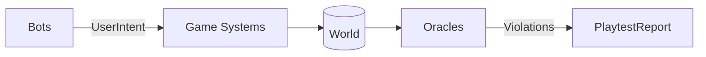

# bevy_swarm

An ECS-native, headless, in-process playtesting harness for [Bevy](https://bevy.org) games. Write WHAT to test, not WHEN to press.

**Requires Bevy 0.19 or later** (uses the `MessageReader`/`MessageWriter` buffered-event API and `World::iter_entities`/`resource_entities`, both introduced in 0.19).

## What it does

- **Typed intent bots** — chaos (with aggressive/curious/idle personas), replay, pursuit, planner (aplib-style goal trees), synthetic_pointer and synthetic_keyboard (drive the REAL input chain through picking/ButtonInput, not shortcuts)
- **Invariant DSL** — scenario JSON with bounds checks, TestApi predicates, eventual assertions, query-target entity counts, differential rules (no_decrease/no_increase), rate limits, expert-rule oracles (WHEN/REQUIRE)
- **Oracles** — frozen-world soft-lock detection, Welford frame-time anomaly detection, true rolling p99, readiness gate
- **CA² system coverage** — which registered systems actually executed, with zero instrumentation (wrap-safe schedule tick-age snapshots)
- **Crash minimization** — ddmin over the structured action log produces a ready-to-save regression scenario
- **Calibration** — `--calibrate` runs a chaos session and derives suggested invariants from archetype-count envelopes, with zero game annotations
- **Loud contracts** — missing picking backends, unresolved TestApi paths, vacuous setups REJECT the scenario instead of silently passing

## Usage

```toml
[dev-dependencies]
bevy_swarm = "0.1" # or path/git
```

```rust
use bevy_swarm::harness::{run_scenario, validate_scenario, Scenario};

let scenario: Scenario = serde_json::from_str(
    r#"{"bot":{"type":"planner","goals":{"kind":"primitive","path":"TestApi.score","check":"above","value":3,"emit":[{"intent":"choice","index":0}]}},"duration_s":1.0,"invariants":[]}"#,
)?;

let mut app = build_your_headless_app(); // your game's plugins + PlaytestPlugin
let report = run_scenario(&mut app, &scenario)?;
assert_eq!(report.status, "pass");
```

## Game-side contract (deliberately thin)

1. `TestApi` resource implementing `TestApiResolve` — publish observable state (score, phase, hp...) for invariants and planner goals
2. `IntentSurface` — declare your game's input verbs; the chaos bot samples only from it
3. Optional: `ResetHooks`, `CheatHooks`, genre markers (`TurnBased`/`RealTime`), `Gameplay` marker component

Games with none of these still work: reflection-based percepts and auto-discovery calibration kick in, and the harness fails loudly rather than passing vacuously when a contract piece it needs is missing.

## Feature flags

- `agent` — BRP-based resident agent for live inspection and intent injection

## Architecture

At its core, the data flow per frame:



- **Bots** (chaos, replay, pursuit, planner) sample from your declared `IntentSurface` and write typed `UserIntent` messages
- **Game systems** consume those intents directly — same schedule, same binary, no adapter layer
- **Oracles** (frozen-world, frame-time anomaly, bounds checks, invariant DSL) watch the world and report violations
- **Synthetic input** is opt-in: `synthetic_pointer`/`synthetic_keyboard` bots drive the real `PointerInput`/`KeyPressInput` chain when a scenario asks for it
- The harness itself is pre/post-processing around the Bevy app — `run_scenario()` sets up, pumps the loop, then collects the report

## Development

```
cargo test    # 23 lib tests (mutation-benchmark-backed)
```

Requires Bevy 0.19 or later with the `debug` feature for real system names.
